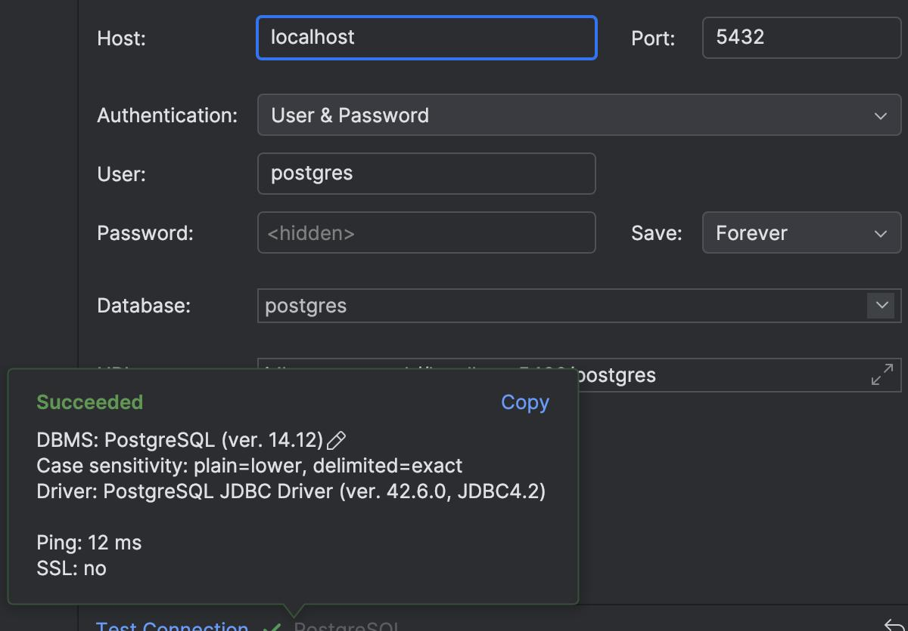

## Como empezar

1. Primer paso, entrar a `.env.example`, renombrar el archivo a `.env.local` y completar los datos:

```bash
POSTGRES_URL="YOUR POSTGRES URL"
POSTGRES_USER="YOUR POSTGRES USER"
POSTGRES_PASSWORD="YOUR POSTGRES PASSWORD"
POSTGRES_DATABASE="YOUR POSTGRES DATABASE NAME"
```

2. Segundo paso, levantar Docker:

```bash
docker compose up
```

3. Tercer paso, popular la base de datos desde la aplicación web
```bash
npm run seed
```

La aplicación web se abre por defecto en [http://localhost:3000](http://localhost:3000).

## Opcional

Testear la conexión a la base de datos enseguida despues del segundo paso.


